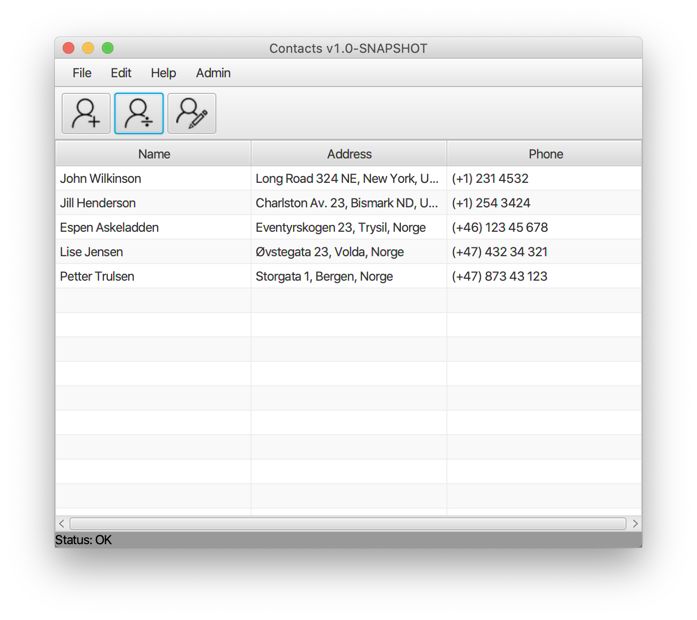

# Contacts - an address book project

## Introduction
A JavaFX-project of a typical address book application. Used to demonstrate JavaFX, GUI design, use of the TableView-component and the mapping of the TabelView to the backend register. Also includes example of file handling.

The project was developed for use in teaching in the course "IDATx2001 Programmering 2" at NTNU spring 2020.

## Release notes

**Version** | **Description**
--------|------------
v0.3 | Adds object serialization of the entire address book. 
v0.2 | Added import and export from/to CSV-file. A default CSV-file is provided (Addresses.csv)
v0.1 | First release with basic add, edit, delete functionality.

## Description of the project
The project is made to demonstrate a typical application with a graphical user interface (GUI) implemented in JavaFX.
It's a classic address book example, where you can create contacts to be added to the address book, edit existing
 contacts, and delete contacts.
The project does **not** make use of FXML and SceneBulider, but builds the GUI from within the Java code.
 
 #### JavaFX concepts demonstrated in the project
 The project uses JDK 8 for simplicity, since JavaFX was bundeled with the JDK up to and including JDK 8. After JDK 8
 , JavaFX (and other packages) were moved into *modules* making it a bit more complex to create JavaFX based
  applications.
  
  The following JavaFX concepts are demonstrated in this project:
  * General JavaFX structure: Stage, Scene, Scenegraph, Nodes etc.
  * Event handling, using Lamda
  * Menu bar, toolbar, status bar
  * Buttons with icons
  * MenuItems with icon and keyboard shortcuts.
  * TableView for displaying a table, linking the table view to the backend AddressBook without adding JavaFX
   specific types to neither the AddressBook-class not the ContactDetails-class
  * Model-View-Controller: A separate Controller-class has been created performing the typical controller role in a
   typical MVC setting. The MVC is reflected in the package names in the project. **NOTE:** we have used "model" as the
    name of the package containing those classes that makes up the model-type of functionality. In a "real life
    " industry project, you would never use a single package named model (or even "view" for that matter). The package
     names should reflect the *functionality* and *services* provided by the classes in the package, and not the
      architecture of the application. In this project, the packages *view, model* and *controllers* is used for
       pedagogical purposes.
  * File-handling: Import/Export to CSV text file, in addition to object serialization used to provide persistence
   between sessions. Whenever the application closes down, the address book is saved to the file "addresses.dat
   ". Upon startup, the same file is being read to re-create the content of the address book from last session.
   
 ## Quality control of code and style
 The project has used both [CheckStyle](https://checkstyle.sourceforge.io/) and the [SonarLint](https://www.sonarlint
 .org/) plugin to [IntelliJ](https://www.jetbrains.com/idea/) for code quality and coding style. For coding style
 , the checkstyle [checks from Google](https://checkstyle.sourceforge.io/google_style.html) have been used.
  